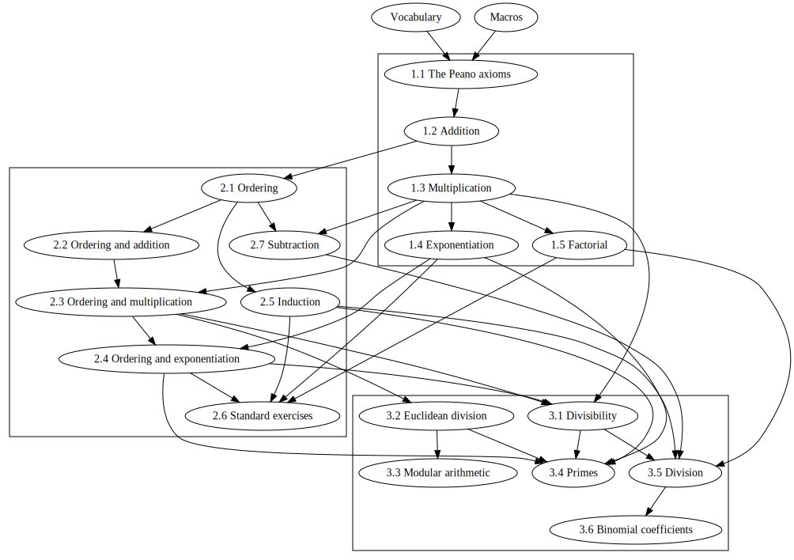

# Arithmetic

A formalization of Peano arithmetic

## Contents

1.  Arithmetic  

    1.1 Peano axioms  
    1.2 Addition  
    1.3 Multiplication  
    1.4 Exponentiation  
    1.5 Factorial

2.  Ordering  

    2.1 Ordering  
    2.2 Ordering and addition  
    2.3 Ordering and multiplication  
    2.4 Ordering and exponentiation  
    2.5 Induction  
    2.6 Standard exercises  
    2.7 Subtraction

3.  Divisibility  

    3.1 Divisibility  
    3.2 Euclidean division  
    3.3 Modular arithmetic  
    3.4 Primes  
    3.5 Division  
    4.6 Binomial coefficients

## Dependency graph

