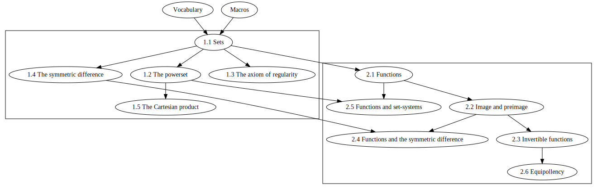

# Set Theory

A formalization of a ZF-like set theory

## Content

1.  Sets  

    1.1 Sets  
    1.2 The powerset  
    1.3 Regularity  
    1.4 The symmetric difference  
    1.5 The Cartesian product

2.  Functions  

    2.1 Functions
    2.2 Image and preimage  
    2.3 Invertible functions  
    2.4 Functions and the symmetric difference  
    2.5 Functions and set-systems  
    2.6 Equipollency

## Dependency graph

